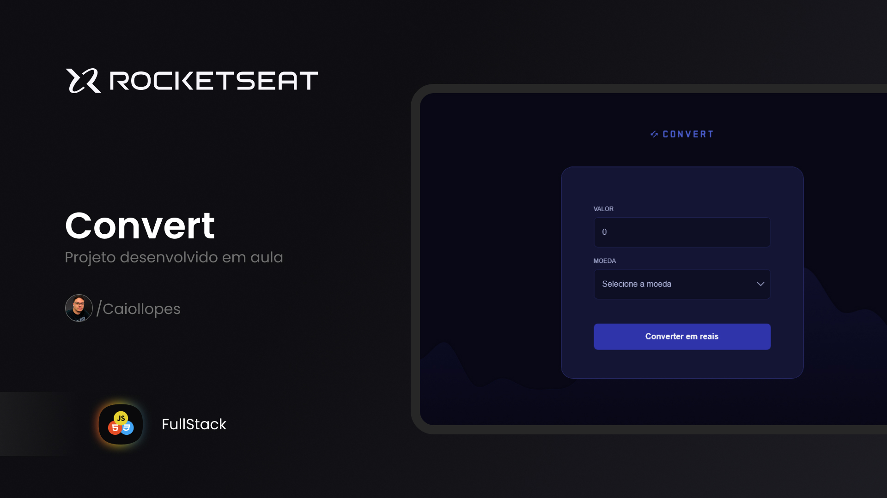

<h1 align="center"> Convert </h1>

 

  

## 💻 Projeto

Convert é um projeto desenvolvido em aula para praticar o que aprendi e desenvolvi.

## 📚 Aprendizado

Neste projeto eu aprendi:

- Introdução com JavaScript
- Variáveis e Constantes
- Expressões e Operadores
- Condicionais e Controle de fluxo
- Funções
- DOM
- Depuração de código

## 🚀 Tecnologias

Esse projeto foi desenvolvido com as seguintes tecnologias:

- HTML e CSS
- Git e Github
- Figma
- JavaScript

## 🔖 Web site

Você pode visualizar este projeto 
<a href="https://github.com/Caiollopes/convert-rks" target="_blank">Clicando aqui!</a>
